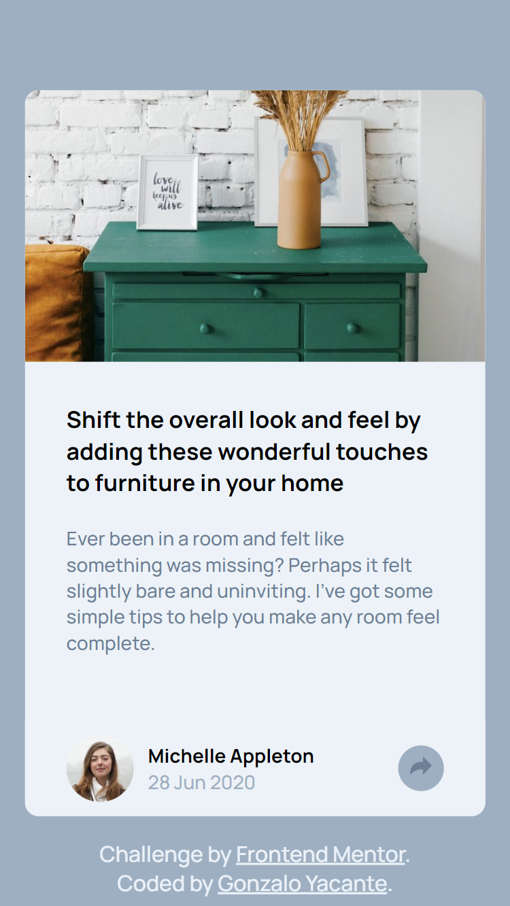
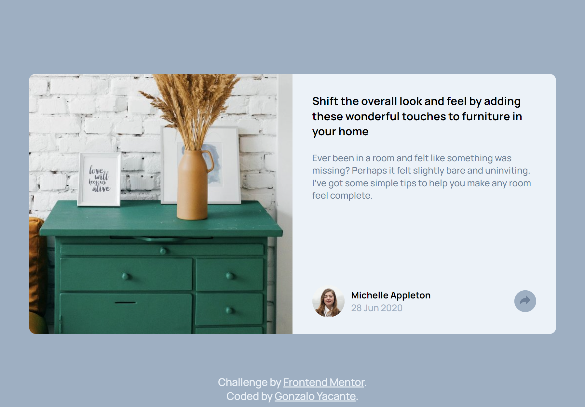

# Frontend Mentor - Article preview component solution (English)

This is a solution to the [Article preview component challenge on Frontend Mentor](https://www.frontendmentor.io/challenges/article-preview-component-dYBN_pYFT). Frontend Mentor challenges help you improve your coding skills by building realistic projects.

## Table of Contents

- [Screenshot](#screenshot)
- [Links](#links)
- [My process](#my-process)
- [Built with](#built-with)
- [Continuous development](#continuous-development)
- [Useful resources](#useful-resources)
- [Author](#author)

### Screenshot

### Links

- Solution URL: [GitHub](https://github.com/gonzaloyacante/Article-preview-component)
- Live Site URL: [Web](https://article-preview-component-gonzaloyacante.vercel.app/)

### Built with

- Semantic HTML5
- CSS custom properties
- Flex box
- Mobile first workflow
- Responsive design

### Continuous development

- CSS Preprocessor
- JavaScript

### Useful resources

- [Platzi](https://platzi.com) - Platzi is an online platform for effective education where I learned the skills to carry out this project.

## Author

- Website - [Gonzalo Yacante](https://gonzaloyacante.github.io/portfolio/)
- Linkedin - [Gonzalo Yacante](https://www.linkedin.com/in/gonzaloyacante/)
- Frontend Mentor - [@GonzaloYacante](https://www.frontendmentor.io/profile/GonzaloYacante)
- Instagram - [@gonzaloyacante](https://www.instagram.com/gonzaloyacante/)

# Frontend Mentor - Solución de componentes de vista previa de artículos (Español)

Esta es una solución al [desafío del componente de vista previa del artículo en Frontend Mentor] (https://www.frontendmentor.io/challenges/article-preview-component-dYBN_pYFT). Los desafíos de Frontend Mentor lo ayudan a mejorar sus habilidades de codificación mediante la creación de proyectos realistas.

## Tabla de contenido

- [Captura de pantalla](#captura-de-pantalla)
- [Enlaces](#enlaces)
- [Mi proceso](#mi-proceso)
- [Construido con](#construido-con)
- [Desarrollo continuo](#desarrollo-continuo)
- [Recursos útiles](#recursos-útiles)
- [Autor](#autor)

### Captura de pantalla

### Enlaces

- URL de la solución: [GitHub](https://github.com/gonzaloyacante/Article-preview-component)
- URL del sitio en vivo: [Web](https://article-preview-component-gonzaloyacante.vercel.app/)

### Construido con

- HTML5 semántico
- Propiedades personalizadas de CSS3
- Caja flexible
- Flujo de trabajo móvil primero
- Diseño responsivo

### Desarrollo continuo

- Preprocesadores CSS
- JavaScript

### Recursos útiles

- [Platzi](https://platzi.com) - Platzi es una plataforma online de educación efectiva donde aprendí las habilidades para realizar este proyecto.

## Autor

- Sitio Web - [Gonzalo Yacante](https://gonzaloyacante.github.io/portfolio/)
- Linkedin - [Gonzalo Yacante](https://www.linkedin.com/in/gonzaloyacante/)
- Frontend Mentor - [@GonzaloYacante](https://www.frontendmentor.io/profile/GonzaloYacante)
- Instagram - [@gonzaloyacante](https://www.instagram.com/gonzaloyacante/)
